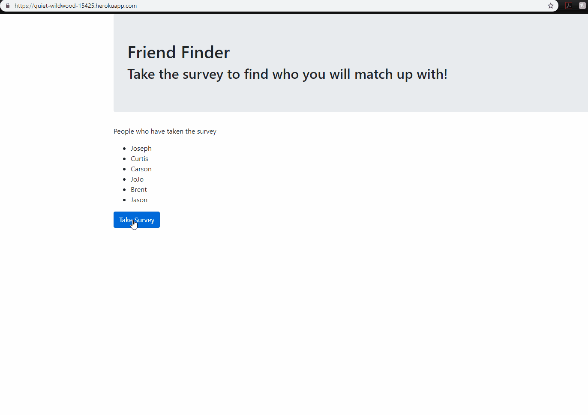

# friendfinder

This app helps you find friends based on score generated from survey taken.   
All information collected is store on server until server reboot.

In order to run code, express and bodyparser npm packages must be downloaded.

Friendfinder proprietary formula in uses sophisticated sum of survey and compares to previous totals.

